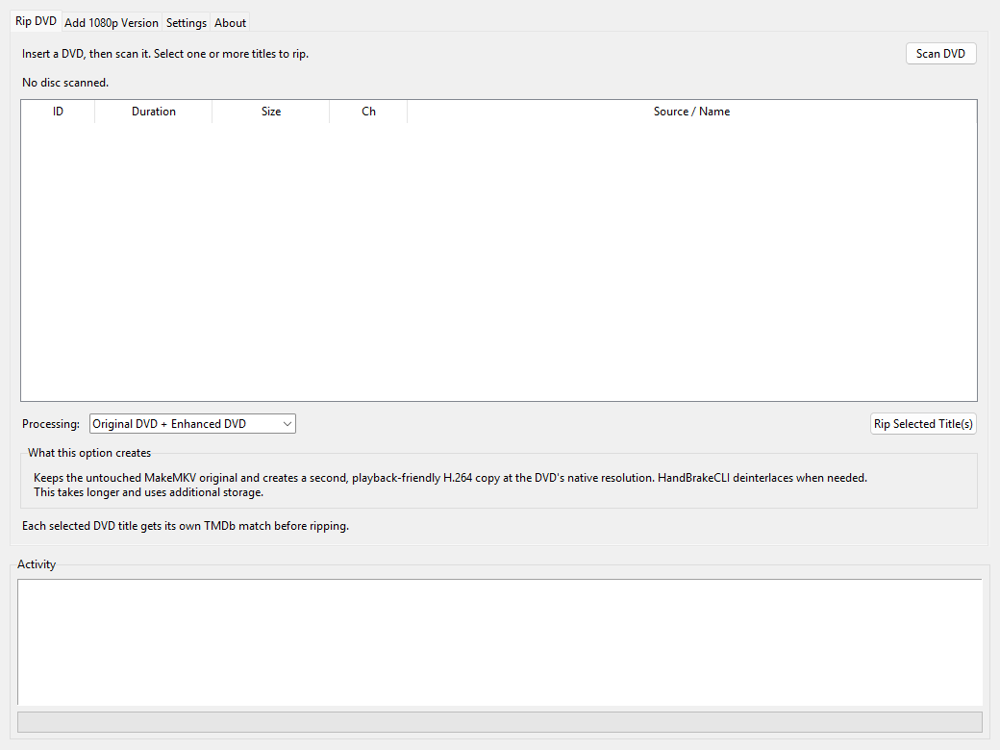

# RipFoundry for Windows



A Windows-native GUI port of the Ubuntu **Rip DVD to Jellyfin** and **Add 1080p Jellyfin Version** workflows.

## What moved to Windows

The expensive work now runs on the Windows PC:

1. MakeMKV rips the DVD to **local Windows staging**.
2. Optional HandBrake Enhanced DVD or FFmpeg 1080p encoding also runs locally.
3. FFprobe validates the output.
4. Only completed files are copied to the user-configured media library destination.
5. A SHA-256 checksum is calculated on both the local file and temporary NAS copy.
6. The destination file is only finalized after the checksums match.

This means the Ubuntu Jellyfin server is no longer doing DVD ripping or video encoding.

## Preserved features

- MakeMKV DVD title scan
- Single-title and multi-title selection
- Disc-label title suggestion
- TMDb assisted metadata matching
- Manual TMDb metadata fallback
- Jellyfin folder naming with `[tmdbid-ID]`
- Original MakeMKV remux retained
- Optional **Enhanced DVD** H.264 version
- Optional **1080p** H.264 version
- Correct Jellyfin multi-version naming (` - 480p`, ` - 480p Enhanced`, ` - 1080p`)
- Aspect-ratio-preserving 1080-height scaling
- Selective deinterlacing
- Audio, subtitles, metadata, and chapters carried forward where the encoder supports them
- FFprobe duration/resolution/codec validation
- Local staging retained when a job fails
- SHA-256 verified transfer to the configured media destination
- Existing-library **Add 1080p Version** workflow

## Requirements on the Windows PC

Install:

- Python 3.10+
- [MakeMKV](https://www.makemkv.com/download/) — installs the `makemkvcon64.exe` console tool used to scan and rip DVDs
- [FFmpeg + FFprobe](https://ffmpeg.org/download.html#build-windows) — use one of the Windows builds linked by FFmpeg.org; FFmpeg creates 1080p versions and FFprobe validates completed files
- [HandBrakeCLI](https://handbrake.fr/downloads2.php) — only required when using **Original DVD + Enhanced DVD**

The program automatically checks `PATH` and common Windows installation locations. Open **Settings** to see a green **Ready** or a clear **Not found** indicator for every tool. Each row also has:

- **Locate...** to select an executable manually
- **Get** to open the official download page
- Helper text and a tooltip explaining what the tool does

For MakeMKV, select `makemkvcon64.exe` (or `makemkvcon.exe`), not the regular `MakeMKV.exe` desktop interface. FFmpeg and FFprobe usually live together in the same extracted `bin` folder.

## First launch

Run:

```text
Launch-RipFoundry.bat
```

Or right-click `Install-Shortcut.ps1` and choose **Run with PowerShell** to create a desktop shortcut.
The shortcut uses the included RipFoundry icon.

### Storage settings

On first launch, open **Settings** and choose **Media Library Destination**. This can be:

```text
\\server\share\Movies     # UNC path
M:\Movies                  # mapped network drive
D:\Media\Movies           # local folder
```

Use **Browse...** to select a folder or type/paste a UNC path directly. Click **Test Destination** to verify that Windows can reach the folder and create files there. The selection is saved in `%APPDATA%\RipFoundry\config.json`.

### DVD drive selector

RipFoundry now lists detected Windows DVD/CD drives by drive letter. A choice such as:

```text
D: - DVD/CD drive - MakeMKV disc:0
```

means that the familiar Windows `D:` drive is passed to MakeMKV as its first optical-drive source, `disc:0`. A second optical drive is shown as `disc:1`. Click **Refresh Drives** after connecting a USB DVD drive.

If Windows does not report an optical drive, the selector explains that RipFoundry will keep MakeMKV's `disc:0` default. Advanced users can still type a `disc:N` source directly.

Local staging still defaults to:

```text
%USERPROFILE%\Videos\RipFoundry Staging
```

A mapped drive letter is not required. For a NAS, a UNC path is generally preferable because it does not depend on a drive-letter mapping.

## TMDb setup

In **Settings**, paste your TMDb **API Read Access Token**. It is stored in:

```text
%APPDATA%\RipFoundry\config.json
```

The movie naming format is:

```text
Movie Name (Year) [tmdbid-123]\
    Movie Name (Year) [tmdbid-123] - 480p.mkv
    Movie Name (Year) [tmdbid-123] - 1080p.mkv
```

or:

```text
Movie Name (Year) [tmdbid-123]\
    Movie Name (Year) [tmdbid-123] - 480p.mkv
    Movie Name (Year) [tmdbid-123] - 480p Enhanced.mkv
```

## Encoding settings in plain language

- **CRF** controls x264 quality. The default `18` produces high quality and larger files. Higher values reduce file size and quality.
- **1080p x264 preset** controls encoding speed versus compression efficiency. `slow` is the recommended balance.
- **Local staging** is temporary working space on the Windows PC. RipFoundry rips and encodes there first, then copies only validated output to the configured media destination.

## Rip DVD tab

1. Insert the DVD.
2. Click **Scan DVD**.
3. Select the main movie title. Ctrl-click supports collection discs with multiple titles.
4. Choose the processing mode:
   - **Original DVD + Enhanced DVD** keeps the untouched MakeMKV original and creates a second H.264 copy at the DVD's native resolution. HandBrakeCLI deinterlaces when needed and produces a more playback-friendly version.
   - **Original DVD + 1080p** keeps the untouched original and creates a second H.264 copy scaled to 1080p with FFmpeg. This may improve playback compatibility but cannot restore HD detail that was not on the DVD.
   - **Original DVD only** keeps only the untouched MakeMKV remux at the DVD's native resolution. It is the fastest option and requires no extra encoding space.
5. Click **Rip Selected Title(s)**.
6. Match each selected DVD title to TMDb.
7. Confirm the plan.

The rip/encode happens locally. Completed media is then transferred and checksum-verified at the configured Media Library Destination.

## Add 1080p Version tab

1. Search for the movie in the configured media library.
2. Select the native/original MKV.
3. Click **Add 1080p Version**.

The app reads the source from the configured library, performs the encode on the Windows PC's local staging directory, validates it, then copies the finished 1080p version back to the movie folder with checksum verification.

The original file is preserved. If an older library item uses:

```text
Movie Name (Year) [tmdbid-123].mkv
```

it is renamed after a successful encode to its native resolution form, for example:

```text
Movie Name (Year) [tmdbid-123] - 480p.mkv
```

## Build a normal Windows EXE

After testing the Python version, run:

```powershell
powershell -ExecutionPolicy Bypass -File .\Build-EXE.ps1
```

That uses PyInstaller to produce:

```text
dist\RipFoundry\RipFoundry.exe
```

You can then launch RipFoundry without a console window.
The build script embeds the RipFoundry logo in the EXE and bundles the artwork used by the app's title bar, taskbar, and About tab.

## Roadmap

### Windows installer (possible next release)

A traditional Windows installer is planned as a possible next-version improvement. The goal is to provide a familiar `RipFoundry-Setup.exe` experience that:

- Installs the compiled application into a standard Windows application folder
- Adds the RipFoundry icon to the Start menu and Windows Search
- Offers an optional desktop shortcut
- Adds RipFoundry to **Installed apps** with a normal uninstaller
- Preserves user settings during upgrades
- Does not require users to install Python or keep the extracted project folder in a particular location

The current 1.1.0 package remains a portable project package: keep the extracted folder in a permanent location, or use `Build-EXE.ps1` to build the Windows executable locally.

## Safety behavior

RipFoundry deliberately does not copy unfinished encoder output straight into the Jellyfin library. New files remain in local staging until validation succeeds. Transfers use a `.partial` filename and SHA-256 verification before the final filename is created.

If a rip or encode fails, the staging files are left in place for troubleshooting.

## Note about DVD upscaling

A DVD-to-1080p encode is conventional scaling. It does not recover HD detail that was never present on the DVD. The untouched MakeMKV remux remains the archival version.

## Project attribution

RipFoundry is built by **Kyle Reddoch (CybersecKyle)**.

Website: **https://www.kylereddoch.me**

Repository: **https://github.com/kylereddoch/RipFoundry-for-Windows**

The Windows app includes this attribution and the RipFoundry mark in its **About** tab. The `RipFoundry for Windows 1.1.0` line opens the GitHub repository in the default browser.
